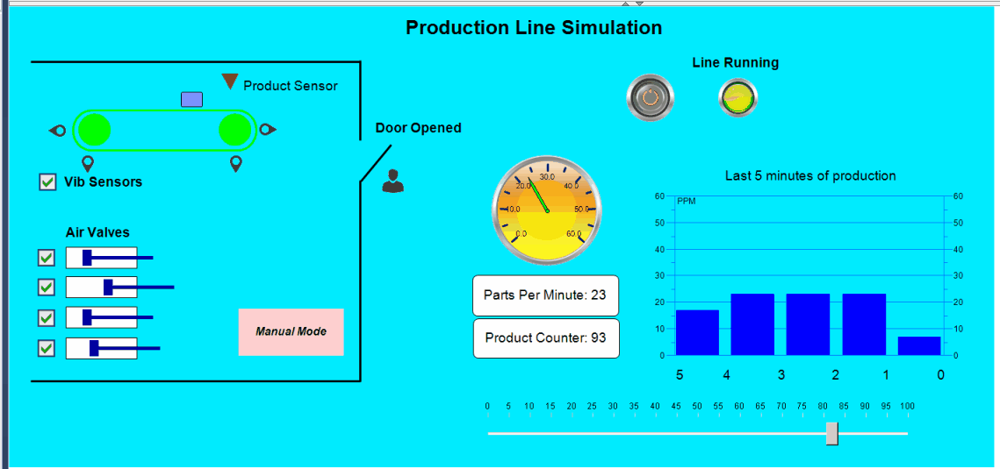

# IIoT Real-Time Analytics using Python with FastAPI and Beckhoff IPC with REST API

IIoT project for data exchange between PLC in OT and IT area with usage of REST API and data analytics.

## System Diagram

## General Overview
Using this framework it's possible to collect data from different sensors, PLCs and devices in OT area. 
The collected data are preprocessed in Beckhoff IPC, converted into JSON payload and published as HTTP REST API POST request to HTTP Server located in IT area.

In IT area, there are is a containerized Python app deployed with FastAPI which runs using Docker (Docker-Compose).

The Http server handles several endpoints for POST requests and one for GET request (for now just simple simulation of MES system). 
The Http server performs also analytics, anomaly detection in sensor signals and finally stores the results in time series database(TSDB) InfluxDB. 
The graphical results are visible as dashboards in Grafana.

This repo includes exclusively code for PLC Beckhoff in TwinCat3. The software framework of IT area is placed in separated GitHub repo.

The TwinCat project includes simulation where simplified real-world industrial line with devices and components can generate data and publish it over MQTT  

